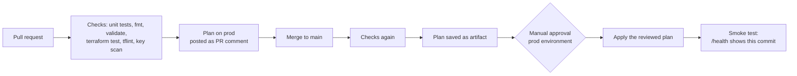

# IIM CI/CD Template: automated testing, CI/CD and deployment

A small serverless API (Lambda + HTTP API) wired to a complete GitHub Actions pipeline. Students fork it, run the one-time bootstrap, then change code and watch every stage run.

**Cost:** pay-per-request services only (Lambda, HTTP API, CloudWatch logs, DynamoDB lock table, S3 state). Expected spend is effectively zero. Nothing here has an hourly charge.

**Status:** statically validated (fmt, validate, offline `terraform test`, unit tests) and plan-checked against the real AWS provider. It has not been applied to AWS or run on GitHub yet. Do a timed dry run in a throwaway account before the session.

## What the pipeline proves



| Stage | Where | What it catches |
| --- | --- | --- |
| App unit tests | `src/handler.test.mjs` | Broken business logic before anything is deployed |
| Terraform format, validate | `checks.yml` | Syntax and wiring errors |
| Offline infra tests | `terraform/tests/plan.tftest.hcl` | Missing tags, wrong runtime, wildcard trust, non-prod environment, with AWS mocked |
| tflint | `.tflint.hcl` | AWS-specific mistakes, undocumented variables |
| Key scan | `checks.yml` | Committed AWS access keys |
| Plan on PR | `ci.yml` | Shows exactly what a change would create or destroy |
| Approval gate | `prod` environment | A human reads the plan before anything changes |
| Apply of the saved plan | `deploy.yml` | The reviewed plan is what is applied, nothing newer |
| Smoke test | `scripts/smoke-test.sh` | The new version is actually live and the API responds |

## Layout

```text
src/                      Lambda code + unit tests (no dependencies, no build step)
terraform/                App root: Lambda, HTTP API, logs. env/prod.tfvars, tests/
bootstrap/                One-time per AWS account: state bucket, lock table, OIDC, plan + deploy roles
scripts/smoke-test.sh     Post-deploy verification
.github/workflows/        checks (reusable), ci, deploy, destroy
.github/actions/          terraform-init (composite)
```

## One-time setup (about 15 minutes)

Use your personal AWS account and the workspace-local profile from the setup guide.

1. **Edit** `terraform/env/prod.tfvars`: set `owner` to your GitHub username. Commit it on a branch.
2. **Bootstrap AWS.** From `bootstrap/`:

   ```powershell
   Copy-Item terraform.tfvars.example terraform.tfvars   # set github_owner and github_repo (your fork)
   terraform init
   terraform apply
   terraform output github_actions_variables
   ```

   If the account already has a GitHub OIDC provider, add `create_oidc_provider = false` to `terraform.tfvars`. Keep `bootstrap/terraform.tfstate` locally; it is gitignored.
3. **Save the outputs as repository variables** (GitHub: Settings, Secrets and variables, Actions, **Variables** tab): `AWS_REGION`, `TF_STATE_BUCKET`, `TF_LOCK_TABLE`, `AWS_PLAN_ROLE_ARN`, `AWS_DEPLOY_ROLE_ARN`. These are not secrets. Do not add AWS keys to GitHub.
4. **Create the approval gate:** Settings, Environments, New environment `prod`, tick **Required reviewers**, add yourself.
5. **Protect `main`:** Settings, Branches, add a rule requiring a pull request and passing status checks.
6. **Keep the fork public.** Required reviewers on environments are only available on private repos with a paid plan. Everything here is synthetic data.

Until step 3 is done the plan and deploy jobs are skipped and only the checks run. That is expected.

## Demo script

1. **Green path.** Branch, change a company name in `src/handler.mjs`, update the matching test, push, open a PR. Watch the checks, then the plan comment.
2. **Break it on purpose.** Change an expected value in `handler.test.mjs` so it fails. The PR is blocked before AWS is involved.
3. **Break the infra.** Remove the `Owner` tag in `terraform/main.tf`. `terraform test` fails with `Lambda is missing a mandatory tag.`
4. **Merge and approve.** Merge a good PR. Open the Deploy run, read the plan in the run summary, approve the `prod` deployment.
5. **Verify.** The smoke test passes only if `/health` returns the commit SHA you just merged. Call it yourself:

   ```powershell
   Invoke-RestMethod "$(terraform -chdir=terraform output -raw api_endpoint)/health"
   ```
6. **Roll back.** Revert the commit on `main`. The same pipeline redeploys the previous code.

## Run the checks locally

```powershell
cd src;       npm run lint; npm test; cd ..
terraform fmt -check -recursive
cd terraform; terraform init -backend=false; terraform validate; terraform test; cd ..
```

`terraform test` uses a mocked AWS provider and needs Terraform 1.7 or newer. The pipeline pins 1.9.8 in `checks.yml` and in `.github/actions/terraform-init`; change both together.

## Security design

- No long-lived AWS keys anywhere. GitHub assumes roles through OIDC.
- GitHub puts immutable owner and repo IDs in the OIDC subject (`repo:Owner@123/repo@456:...`). The bootstrap reads them from the public GitHub API, so the repo must exist and be public before you apply it. If a role assumption fails with `Not authorized to perform sts:AssumeRoleWithWebIdentity`, look at the failed event in CloudTrail to see the exact subject GitHub sent.
- **Plan role** trusts only this repo's pull requests and `main`. It can read the app's resources and the state, and cannot create or change anything.
- **Deploy role** trusts only jobs that use the `prod` environment, so it is only reachable after approval. It is limited to resources prefixed with `app_name-prod`, and `iam:PassRole` only to Lambda.
- API Gateway cannot be scoped by name before an API exists, so its permissions are scoped by region and path only.
- Terraform state is encrypted, versioned, private, and locked in DynamoDB. One state key per repo: `<repo>/prod/terraform.tfstate`.
- Do not rename `app_name` in only one place. `terraform/env/prod.tfvars` and `bootstrap` must agree or the deploy role is denied.

## Teardown

1. Actions, **Destroy**, Run workflow, type `destroy`, approve. This removes the app.
2. From `bootstrap/`: `terraform destroy`. This removes state, roles and the OIDC provider.
3. Confirm the Billing page shows nothing running.

## Extension exercises

- Add Trivy or Checkov as a security scan job in `checks.yml`.
- Add a DynamoDB table in `terraform/main.tf` and a test that it uses on-demand billing.
- Add a canary alias and weighted rollout for the Lambda.
- Add a scheduled workflow that runs `terraform plan` nightly and fails on drift.

## Promotion notes

This folder lives under `temp/`, so GitHub will not run these workflows here. Promote it as its own repository (for example `iim-cicd-template`) or copy it into a student fork. Before the session, a human must run it once end to end, confirm the tflint ruleset version in `.tflint.hcl` resolves, and confirm the Actions versions are acceptable to the institute's policy.
